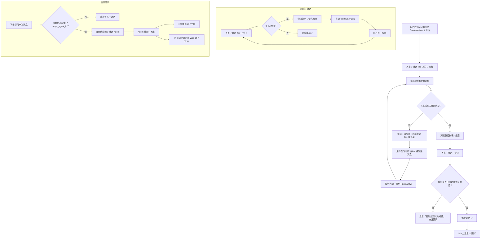
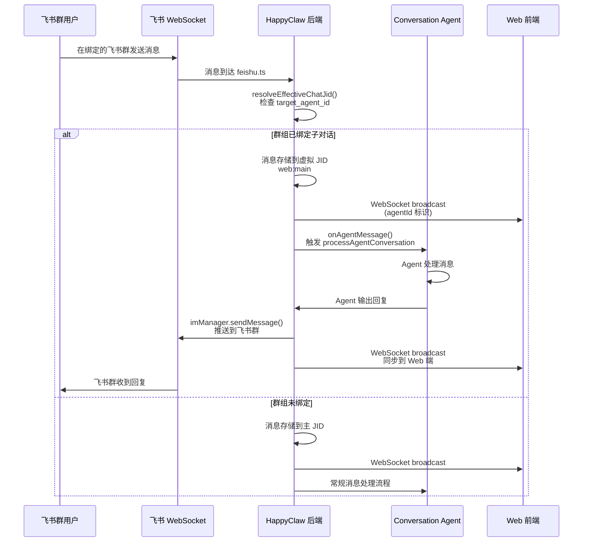

# Changelog: 会话绑定飞书群功能

**版本**: 2026-03-03
**Commit**: `3a31e87` — 功能: 会话绑定飞书群

## 功能概述

新增 **Conversation Agent 子对话与 IM 群组的双向绑定**能力。用户可以在 Web 端创建 conversation 类型的子对话（agent），并将其绑定到一个飞书群。绑定后：

- 飞书群中的消息 **自动路由** 到该子对话的 agent 处理
- Agent 的回复 **自动推送** 到飞书群
- Web 端和飞书群的消息 **共享同一上下文**

这使得用户可以为不同业务场景创建独立的 agent 对话（如"客服助手"、"运维值班"），并将其分别关联到不同的飞书群，实现一个 HappyClaw 工作区服务多个飞书群的能力。

## 飞书 Bot 新增权限要求

为支持在绑定对话框中展示群组信息（头像、名称、成员数），飞书应用需要新增以下 API 权限：

| 权限名称 | 权限标识 | 用途 |
|---------|---------|------|
| **获取群信息** | `im:chat:readonly` | 查询群组头像、名称、成员数、聊天模式（群聊/私聊） |

> **如何添加**：飞书开放平台 → 应用管理 → 你的应用 → 权限管理 → 搜索 `im:chat:readonly` → 开通

如果不添加此权限，绑定功能仍可正常使用，但绑定对话框中将无法显示群组头像和成员数。

## 用户操作指南

### 前置条件

1. HappyClaw Web 端已登录
2. 飞书 Bot 已配置并连接（设置 → IM 通道）
3. 至少有一个飞书群已向 Bot 发送过消息（群组会自动注册）

### 操作步骤

1. **创建子对话**：在 Web 聊天页面，点击 Tab 栏右侧的 `+` 按钮，创建一个 conversation 类型的子对话并命名
2. **打开绑定对话框**：鼠标悬停在子对话 Tab 上，点击出现的 🔗 链接图标
3. **选择飞书群**：在弹出的对话框中，浏览可用的飞书群组（支持搜索），点击「绑定」
4. **完成**：绑定成功后，Tab 上会显示 💬 图标表示已关联 IM 群组
5. **解绑**：再次点击 🔗 图标，在对话框中对已绑定的群组点击「解绑」

### 删除子对话

如果子对话已绑定 IM 群组，**必须先解绑所有群组**才能删除：

1. 点击子对话 Tab 上的 ✕ 关闭按钮
2. 系统检测到有 IM 绑定，弹出提示「该对话已绑定 IM 群组（xxx），请先解绑后再删除」
3. 自动打开绑定对话框，逐一点击「解绑」
4. 全部解绑后，再次点击 ✕ 即可删除

### 注意事项

- 每个飞书群 **只能绑定一个** 子对话（一对一关系）
- 私聊（P2P）不支持绑定，绑定列表中仅显示群聊
- 删除子对话前 **必须先解绑** 所有关联的 IM 群组（后端返回 409 阻止直接删除）
- 绑定后，飞书群的消息不再走主对话，而是直接进入子对话上下文

## 绑定流程图

## 消息路由架构图

## 技术变更详情

### 数据库

| 变更 | 说明 |
|------|------|
| Schema 版本 | v18 → v19 |
| 新增字段 | `registered_groups.target_agent_id TEXT` |
| 新增查询 | `getGroupsByTargetAgent(agentId)` — 查找路由到指定 agent 的所有 IM 群组 |

### 后端 API

| 方法 | 路径 | 说明 |
|------|------|------|
| GET | `/api/groups/:jid/im-groups` | 列出当前 folder 下可绑定的 IM 群组（过滤 Web JID 和私聊） |
| PUT | `/api/groups/:jid/agents/:agentId/im-binding` | 将 IM 群组绑定到子对话 |
| DELETE | `/api/groups/:jid/agents/:agentId/im-binding/:imJid` | 解除绑定 |

### 后端核心逻辑（src/index.ts）

- `buildResolveEffectiveChatJid()` — 根据 `target_agent_id` 将 IM chatJid 映射到虚拟 agent JID
- `buildOnAgentMessage()` — IM 消息触发 `processAgentConversation`
- `processAgentConversation` 输出时遍历 `getGroupsByTargetAgent()` 向已绑定 IM 群组推送回复
- DELETE agent 接口：有 IM 绑定时返回 409 + `linked_im_groups`，阻止直接删除
- 消息循环中跳过有 `target_agent_id` 的群组（避免重复处理）

### 前端

| 文件 | 变更 |
|------|------|
| `ImBindingDialog.tsx` | **新增** — 绑定/解绑对话框组件 |
| `AgentTabBar.tsx` | 绑定状态图标 + 快捷绑定按钮 |
| `ChatView.tsx` | 集成 ImBindingDialog |
| `chat.ts` (store) | `loadAvailableImGroups`、`bindImGroup`、`unbindImGroup` actions |
| `types.ts` | `AvailableImGroup`、`AgentInfo.linked_im_groups` |

### 其他改动

| 变更 | 说明 |
|------|------|
| Docker 镜像加速 | `NODE_IMAGE` 构建参数，支持国内镜像源 |
| Makefile | 合并上游 `maybe-build-image` 宏 + 依赖变更自动检测 |
| runtime-config | `normalizeSecret()` 清理非 ASCII 字符（如智能引号） |
| agent-runner | 新增 `@modelcontextprotocol/sdk` 依赖 |
